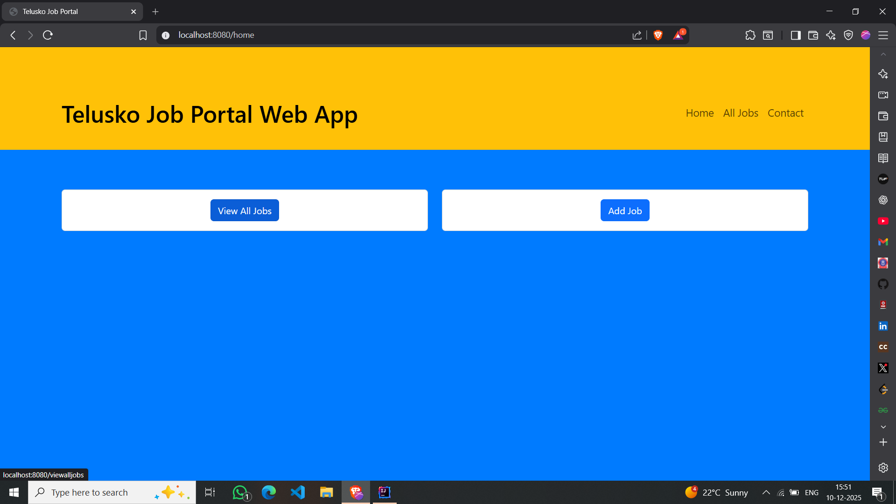
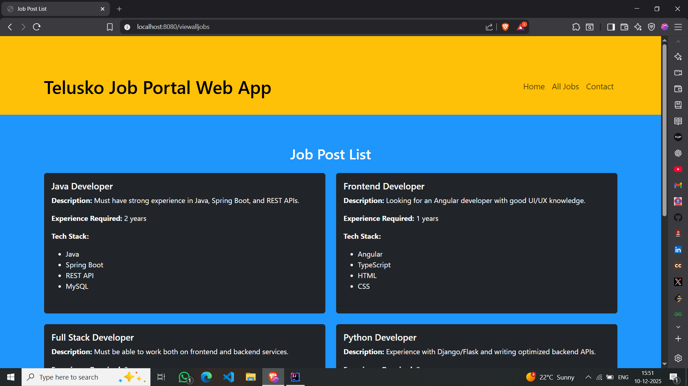
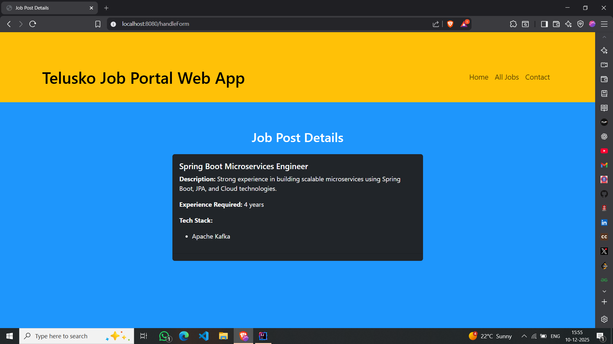

# Job Portal – Spring MVC (Initial Phase)

This project represents my **initial learning phase of Spring Framework**  
where I implemented a **JSP-based UI using Spring MVC architecture**.

The goal of this project was to understand:
- MVC flow in Spring
- Controller → Service → Repository layering
- Form handling using JSP
- Server-side rendering before moving to React

---

## 🛠 Tech Stack (Initial Phase)
- Java 21
- Spring Boot 3
- Spring MVC
- JSP & JSTL
- Maven

---

## 📸 JSP UI Screenshots

### 🏠 Home Page

### ➕ Add Job Form

### 📋 Job Listing

### ✅ Job Added Successfully

---

## 🔁 Learning Progression
After this phase, the same project was:
- Migrated to **REST APIs**
- Repository layer replaced with **Spring Data JPA**
- Frontend replaced with **React**

👉 Those implementations are maintained in **separate repositories**.

